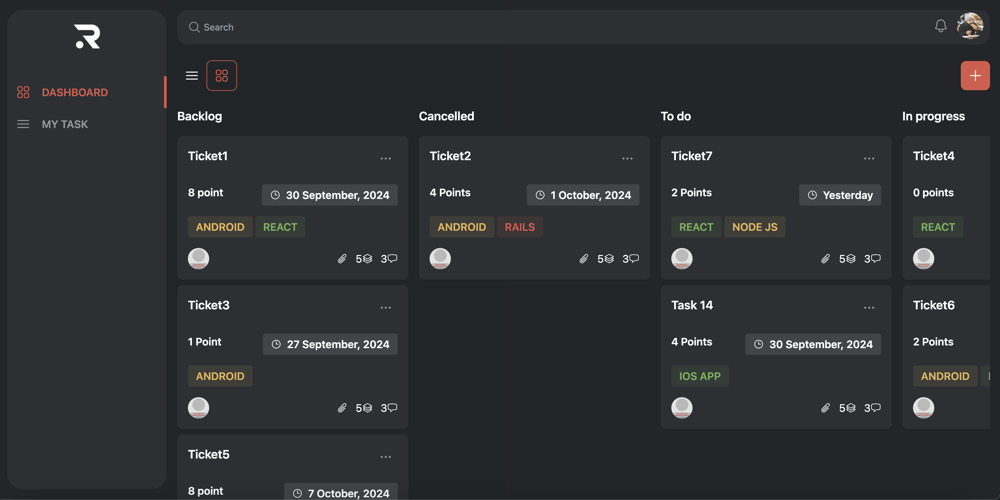
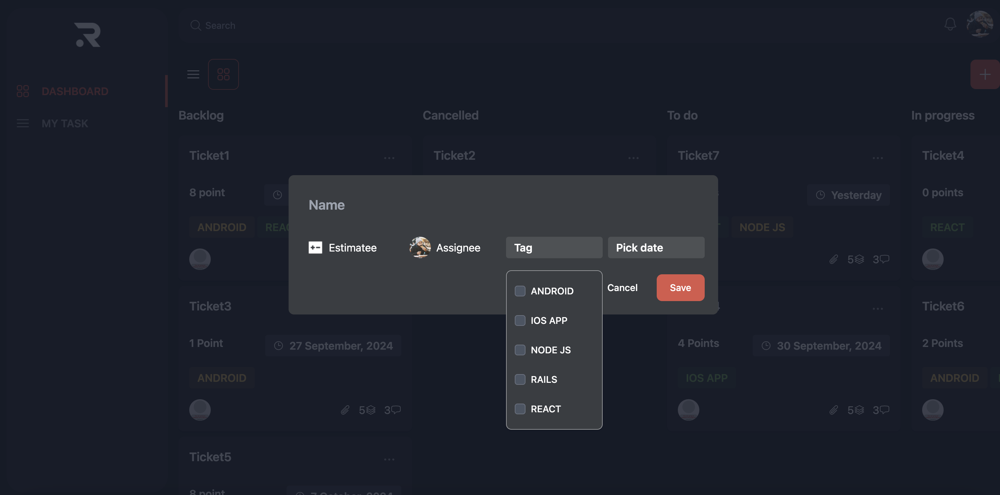

# Task Management

This project is a CRUD (Create, Read, Update, Delete) application for task management, developed with Angular 18 and following Clean Architecture principles.

## Features

- Complete CRUD functionality for task management
- Implementation of Clean Architecture
- Modern and responsive user interface

## Technologies Used

- Angular 18
- TypeScript
- TailwindCSS
- Flowbite
- Toastr
- Apollo Angular
- GraphQL
- ng-icon/heroicons

## Prerequisites

- Node.js (version 20.17.0)
- npm (version 10.8.2)

## Installation

1. Clone this repository:
   ```
   git clone https://github.com/ihluisangel/task-management.git
   ```
2. Navigate to the project directory:
   ```
   cd task-management
   ```
3. Install dependencies:
   ```
   npm install
   ```

## Usage

### Development server

Run `ng serve` for a dev server. Navigate to `http://localhost:4200/`. The application will automatically reload if you change any of the source files.

### Code scaffolding

Run `ng generate component component-name` to generate a new component. You can also use `ng generate directive|pipe|service|class|guard|interface|enum|module`.

### Build

Run `ng build` to build the project. The build artifacts will be stored in the `dist/` directory.

### Running unit tests

Run `ng test` to execute the unit tests via [Karma](https://karma-runner.github.io).

### Running end-to-end tests

Run `ng e2e` to execute the end-to-end tests via a platform of your choice. To use this command, you need to first add a package that implements end-to-end testing capabilities.

## Screenshots

### Grid View

*The Grid View displays tasks in a structured, easy-to-read format.*

### Edit Modal

*The Edit Modal allows users to modify task details efficiently.*

## Further help

To get more help on the Angular CLI use `ng help` or go check out the [Angular CLI Overview and Command Reference](https://angular.dev/tools/cli) page.